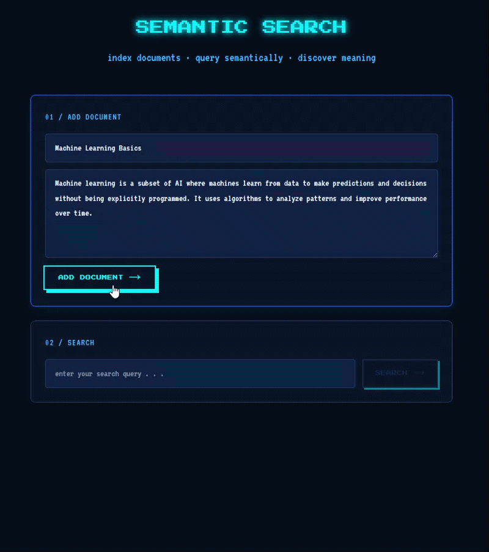

# Semantic Search Engine

A search engine that finds results by meaning rather than 
exact keyword matching. Users can add documents and search 
through them using natural language — the app returns 
results ranked by similarity score even if the exact 
words don't match.

## Demo


## How it works
1. User adds a document with a title and content
2. Backend converts the content to embeddings using 
   a Hugging Face sentence transformer model
3. Embeddings and content are saved to Supabase pgvector
4. User types a search query
5. Query is converted to embeddings
6. Supabase finds the most similar documents using 
   cosine similarity
7. Results are returned ranked by similarity score

## Tech stack
| Layer | Technology |
|---|---|
| Frontend | Next.js, TypeScript, Tailwind CSS |
| Backend | FastAPI, Python |
| Embeddings | Hugging Face all-MiniLM-L6-v2 |
| Database | Supabase + pgvector |
| Deploy | Vercel (frontend), Render (backend) |

## Key features
- Semantic search — finds results by meaning not keywords
- Similarity scores — shows how relevant each result is
- Local embeddings — runs completely free using 
  Hugging Face sentence transformers
- Relevance threshold — filters out low scoring results

## What I learned
- How semantic search works — converting text to numbers 
  that represent meaning so similar concepts are found 
  even with different words
- How similarity scores work — a score close to 1.0 
  means very similar meaning, close to 0.0 means 
  not related at all
- Why each document needs its own embedding — generating 
  one embedding for everything would lose the individual 
  meaning of each document
- Why `.tolist()` is needed — the Hugging Face model 
  returns a numpy array which Supabase cannot store 
  directly, converting to a Python list fixes this
- How pgvector's cosine similarity operator `<=>` 
  measures the distance between two embeddings

## Challenges and solutions
- Forgetting `.tolist()` when saving embeddings → 
  Supabase rejected the numpy array format, fixed by 
  converting to a regular Python list before inserting
- Generating one embedding for all documents instead 
  of per document → search was inaccurate because all 
  documents had the same embedding, fixed by generating 
  embeddings inside the loop for each document
  individually
- Results showing for completely unrelated searches → 
  added a similarity threshold of 0.3 so only relevant 
  results are returned

## Future improvements
- Add better filtering — filter results by category 
  or document type
- Only show results above a higher similarity threshold 
  for more precise results
- Organize documents by topic so users can browse 
  by category
- Add pagination for large document collections
- Add bulk document import feature

## Local setup

### Backend
```bash
cd backend
python -m venv venv
venv\Scripts\activate
pip install -r requirements.txt
uvicorn main:app --reload
```

### Frontend
```bash
cd frontend
npm install
npm run dev
```

## Environment variables
Create a `.env` file in the root folder:
```bash
SUPABASE_URL=your_supabase_url_here
SUPABASE_KEY=your_supabase_key_here
GROQ_API_KEY=your_groq_key_here
```

## Author
Shana Cruzat 
